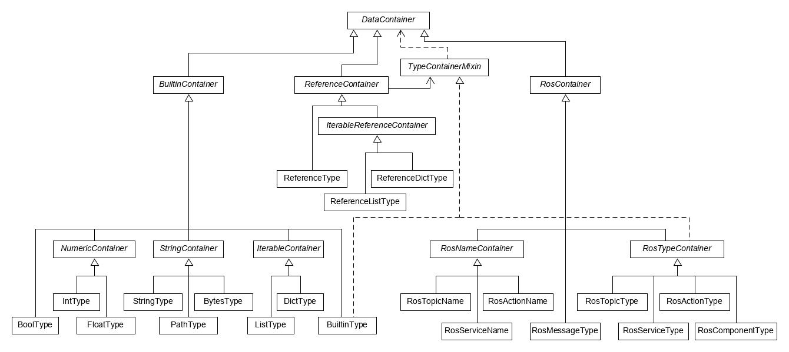

.. _node-data-types:

###############
Node Data Types
###############

.. contents::

The input and output data for our nodes is handled by custom data types that include functions for
storing, validating and serializing data.
Inputs can additionally be set to be static or dynamic, depending on whether they are set at node initialization.

********************
Available Data Types
********************

All data types inherit from a common base class ``DataContainer``, which defines abstract interfaces,
as well as some default implementations where applicable.
An additional mixin base class called ``TypeContainerMixin`` is also available,
its purpose is covered in the section on :ref:`generic types<generic-data-types>`

There are other intermediary classes provide additional common implementations,
while concrete type classes provide default values for their types,
as well as identifiers that are used to for serializing types as ROS messages.

Intermediary classes are commonly named ``...Container``, whereas concrete classes are named ``...Type``.

************
Value Access
************

To prevent accidental data modification (which could persist into future ticks),
both reading and writing data includes an implicit deep copy operation.
Note that this can incur some computational overhead when handling large amounts of data.

*******************
Value Serialization
*******************

Serialization consists of two consecutive phases:

1. Custom serialization based on the specific data type, output has to be json serializable.
2. Plain json serialization to get a stringified output.

This two phase approach means that type like lists, dicts and ROS messages can recursively
serialize their element values using the 1st phase of the respective element data types.

When deserializing serialized values, the two phases are reversed individually and applied in an inverted order.

******************
Generic data types
******************

.. _generic-data-types:

Similar to generic functions and classes, some nodes have type parameters that can determine the types of their inputs and outputs.

Those generics can be realized by specific data types inheriting from ``TypeContainerMixin`` whose values encode other data types.
The those type values can only be set at node initialization, so they are always considered "static".

Those type values can be combined with references, classes inheriting from ``ReferenceContainer``,
which are initialized with a reference to a ``TypeContainerMixin`` instance,
and adapt their own type based on the type value of that instance.
